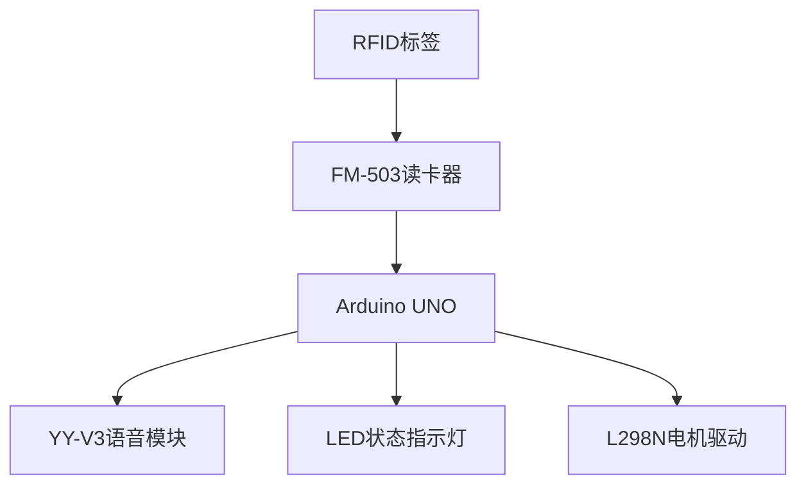
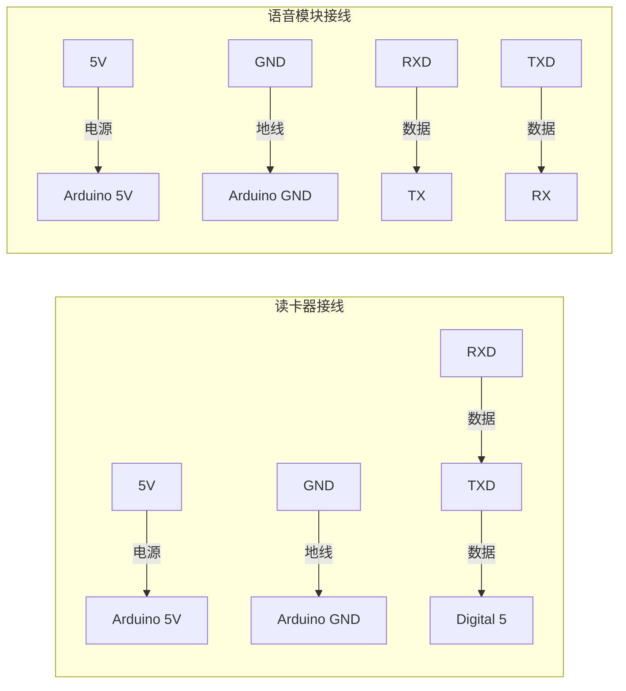

# 长征主题语音教育系统

## 版权声明
`版权所有 蜘蛛电子`  
`淘宝店铺：[蜘蛛电子](https://zhizhudianzi.taobao.com)`

## 硬件清单
| 组件 | 型号 | 采购链接 |
|------|-----|---------|
| RFID读卡器 | FM-503 | [官方店铺](https://zhizhudianzi.taobao.com/item/123) |
| 语音模块 | YY-V3 | [官方店铺](https://zhizhudianzi.taobao.com/item/456) |
| Arduino控制板 | Uno R3 | [官方店铺](https://zhizhudianzi.taobao.com/item/789) |

## 系统架构


## 接线指南


## 使用说明
1. 上电后等待3秒初始化
2. 用RFID标签接触读卡器
3. LED闪烁表示识别成功
4. 语音模块播放对应历史事件讲解

## 二次开发
1. 在yvyin.h中添加新语音指令：
```cpp
byte yuyin_新事件[] = { 
    0x7E, 0x05, 0x41, 0x00, 0x11, 0x55, 0xEF  
};
```
2. 在main loop中添加识别逻辑：
```cpp
for (byte i = 0; i < 16; i++) {
    if(ReceiveData[i+11] == 新事件数组[i]){
        count++;          
    }       
}
```

## 电路原理图


## 技术支持
请联系淘宝店铺客服获取专业技术支持